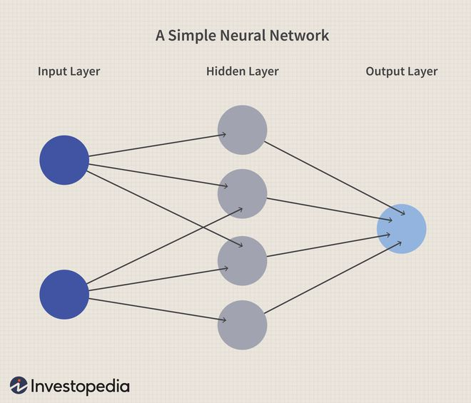

# Bienvenidos a Markdown
## Subtitulo
### Subsubtitulo
#### Subsubsubtitulo
##### Subsubsubsubtitulo

Esto es texto plano y puedo escribir un parrafo.

---

# Listas / Viñetas
- Viñeta 1
- Viñeta 2
    - Viñeta 2.1
    - **negritas**
    - *italicas*
    - ~~tachado~~~
    - `quoted`

---

# Red Neuronal

:max_bytes(150000):strip_icc()/dotdash_Final_Neural_Network_Apr_2020-01-5f4088dfda4c49d99a4d927c9a3a5ba0.jpg)

---

# Red Neuronal
:max_bytes(150000):strip_icc()/dotdash_Final_Neural_Network_Apr_2020-01-5f4088dfda4c49d99a4d927c9a3a5ba0.jpg)

---

# Red neuronal modificada

---

# Hipervinculos

<https://www.unam.mx>

<correo@dominio.com>

Yo asisto a la [FI](http://www.fi-b.unam.mx/)

---

# Tabla 

|Tit1|Tit2|Tit3|
|---|---|---|
|Info1|Info2|Info3|
|Celda1|Celda2|Celda3|
